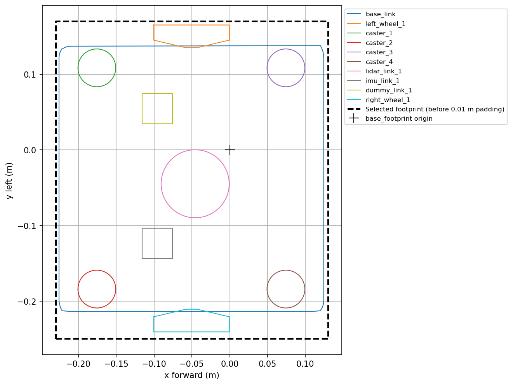

# testbed_navigation

ROS 2 Humble `ament_cmake` package for the assignment's manual Nav2 integration.
Map loading, AMCL localization, and navigation are implemented as independent
manual component launches.

## Files

- `config/map_server_params.yaml`: map-server frame, topic and simulation time.
- `config/amcl_params.yaml`: Humble AMCL baseline with verified robot interfaces.
- `config/nav2_params.yaml`: conservative Testbed navigation/costmap parameters.
- `launch/map_loader.launch.py`: map server and its autostart lifecycle manager.
- `launch/localization.launch.py`: AMCL and its localization lifecycle manager.
- `launch/navigation.launch.py`: four navigation servers and their lifecycle manager.
- `rviz/navigation.rviz`: map, scan, AMCL pose, and 2D Pose Estimate tool in `map`.

CMake installs `launch/`, `config/`, and `rviz/` into the package share directory.

## Selected dependencies

The manifest declares launch dependencies, `ament_index_python`,
`testbed_bringup`, and RViz. It declares the map server,
AMCL, lifecycle manager, planner server with NavFn, controller server with
Regulated Pure Pursuit, costmaps, BT navigator and standard BT plugins, and
behavior server. These declarations do not start or configure those components.

The assignment's README.md and help.md remain the requirements. Component
launches run independently; this package does not invoke
`nav2_bringup` or introduce custom nodes or behavior trees.

## Build and discovery

Inside the project's Humble container:

```bash
cd /workspace
source /opt/ros/humble/setup.bash
colcon build --symlink-install --packages-select testbed_navigation
source install/setup.bash
ros2 pkg prefix testbed_navigation
```

## Map loading

Run independently of simulation and the later localization/navigation stages:

```bash
ros2 launch testbed_navigation map_loader.launch.py
```

The launch resolves `maps/testbed_world.yaml` through the installed
`testbed_bringup` package share directory, loads map-server settings from this
package's installed config, and configures/activates only `map_server` through
`lifecycle_manager_map`. Both nodes use simulation time. Map publication does
not require an advancing simulation clock.

In another sourced Humble terminal:

```bash
ros2 lifecycle get /map_server
ros2 topic echo /map --once --qos-durability transient_local --qos-reliability reliable
rviz2 -d "$(ros2 pkg prefix --share testbed_navigation)/rviz/navigation.rviz" \
  --ros-args -p use_sim_time:=true
```

Expected lifecycle state is `active [3]`. The RViz Map display uses transient-local
durability to receive the map even when RViz starts after its initial publication.

Independent verification passed with `map_server` active, a 405 x 400 map at
0.05 m/cell in frame `map`, and RViz receiving and displaying `/map` after startup.

## Localization

Keep the map loader running. Start the starter simulation and use this RViz
configuration (or load it in the already running RViz):

```bash
ros2 launch testbed_bringup testbed_full_bringup.launch.py \
  rvizconfig:="$(ros2 pkg prefix --share testbed_navigation)/rviz/navigation.rviz"
```

In another sourced Humble terminal:

```bash
ros2 launch testbed_navigation localization.launch.py
ros2 lifecycle get /amcl
```

The localization launch starts only `amcl` and
`lifecycle_manager_localization`, which autostarts/activates only AMCL. It uses
the existing `/map` publisher. Both new nodes use simulation time.

Parameters follow the installed Humble `nav2_bringup` AMCL baseline, with
`map`, `odom`, `base_footprint`, `/scan`, and
`nav2_amcl::DifferentialMotionModel`. Laser limits are 0.10–10.0 m, matching the
simulated sensor. Initial pose loading is disabled; no Gazebo spawn coordinates
are configured as a map-frame initial pose.

With RViz Fixed Frame `map`, select **2D Pose Estimate**, click the robot's
estimated map position, and drag to indicate heading. Check the red scan points
against map walls and refine the estimate if necessary. The verified TF chain is:

```text
map -> odom -> base_footprint -> base_link -> lidar_link_1
```

AMCL's baseline motion thresholds are 0.25 m and 0.2 rad. Expect pose updates
after sufficient manual movement; `/request_nomotion_update` can request a
stationary measurement update for inspection. No planner, controller or BT
navigator is started by this stage.

The combined test exceeded the container's default Cyclone DDS participant
search limit. For sessions that report `Failed to find a free participant index`,
set this runtime environment before starting new components:

```bash
export CYCLONEDDS_URI='<CycloneDDS><Domain id="any"><Discovery><MaxAutoParticipantIndex>100</MaxAutoParticipantIndex></Discovery></Domain></CycloneDDS>'
```

### Localization verification

The existing map loader remained running with exactly one `/map` publisher.
AMCL reached `active [3]` and received the installed 405 x 400 map. A live
scan-to-map comparison supplied an initial estimate independently of Gazebo's
spawn pose; RViz's **2D Pose Estimate** published approximately `(0.083, 5.000)`
with an eastward heading in frame `map`. AMCL logged acceptance of this pose.

In the bounded manual test, `linear.x = 0.05 m/s` for 12 simulated seconds and
`angular.z = 0.1 rad/s` for 4 simulated seconds were followed by zero Twists.
Odometry measured 0.581 m of translation; AMCL tracked 0.561 m. Final headings
were approximately 0.274 rad in odometry and 0.276 rad in AMCL. The largest
observed AMCL position step was 0.231 m, consistent with the baseline movement
update threshold; there was no large pose discontinuity in this test.

After motion, 97.6% of 245 finite scan endpoints were within 0.15 m of occupied
map cells (mean nearest-wall distance 0.027 m, 90th percentile 0.10 m), using
TF at each measured scan's timestamp. RViz showed the red scan overlay on map
walls, and `view_frames` confirmed the complete TF chain above. Stationary
updates were requested through the existing `/request_nomotion_update` service
during verification. These measurements verify this localization test; no
navigation behavior has been implemented.

## Initial-pose decision

Keep RViz **2D Pose Estimate**, with `set_initial_pose: false`. Gazebo's spawn
request is `(x=0, y=5, yaw=0)`. The independently derived scan-to-map estimate
was approximately `(0.075, 5.010, 0)`, and the RViz estimate was
`(0.083, 5.000, 0)`. These are close, but an estimate is not an exact coordinate
calibration. The 0.05 m map resolution, simulated measurement noise, and robot
motion between observations prevent concluding that the frames coincide exactly.

During the verified movement test, final map-frame AMCL position was
approximately `(0.529, 4.888)` versus odometry `(0.540, 4.900)`, with headings
`0.276` and `0.274` rad. This supports approximate consistency, not an exact
map-to-Gazebo identity; odometry is also not a direct Gazebo ground-truth sample.
Automatically seeding `(0,5,0)` would encode that unverified identity. Manual
initialization retains the verified workflow until a calibration supports a
repeatable automatic map-frame pose. No spawn coordinates are added to AMCL.

## Navigation architecture

Target: basic ROS 2 Humble `NavigateToPose`, using independent component launches.
The existing map loader and localization launch remain separate prerequisites.
All navigation components use simulation time and `base_footprint` as the
robot base, with the verified `map -> odom -> base_footprint -> base_link ->
lidar_link_1` chain.

| Component | Selection and reason |
| --- | --- |
| Global planner | `planner_server` loads `nav2_navfn_planner/NavfnPlanner` as `GridBased`, computing a global path on the global costmap. |
| Controller | `controller_server` loads `nav2_regulated_pure_pursuit_controller::RegulatedPurePursuitController` as `FollowPath`, tracking the path and producing `/cmd_vel` for the existing diff-drive plugin. It consumes the local costmap and `/odom`. |
| Controller checks | Built-in `nav2_controller::SimpleProgressChecker` detects stalled motion; `nav2_controller::SimpleGoalChecker` determines position/orientation goal completion. |
| Recoveries | `behavior_server` loads `nav2_behaviors/Spin`, `nav2_behaviors/BackUp`, and `nav2_behaviors/Wait` as `spin`, `backup`, and `wait`. The stock tree calls these actions; moving recoveries use the local costmap/footprint for collision checking. |
| Goal coordination | `bt_navigator` exposes the `NavigateToPose` workflow and runs the stock Humble planning/control/recovery tree. |
| Lifecycle | `lifecycle_manager_navigation` autostarts only `planner_server`, `controller_server`, `behavior_server`, and `bt_navigator`, in that order. It does not manage or duplicate the existing map server or AMCL. |

The selected plugin identifiers and stock BT were checked against installed
Humble Nav2 1.1.20 resources. NavFn uses Humble's exported slash-form identifier;
RPP uses its exported C++ type identifier.

### Stock behavior tree

Resolve `behavior_trees/navigate_to_pose_w_replanning_and_recovery.xml` from the
installed `nav2_bt_navigator` package share through YAML substitutions. Do not
copy or modify the XML. Load the standard `nav2_behavior_tree` node libraries
required by its nodes.

The installed tree replans at 1 Hz and references planner ID `GridBased` and
controller ID `FollowPath`. Its contextual and general recoveries clear the
global/local costmaps through their existing `clear_entirely_*_costmap` services,
then cycle through Spin, Wait, and BackUp. These costmap service operations are
part of the stock tree, not additional recovery servers.

### Costmaps

| Costmap | Frame and mode | Layers, in order | Inputs and purpose |
| --- | --- | --- | --- |
| Local, owned by `controller_server` | `odom`, rolling | `nav2_costmap_2d::ObstacleLayer`, `nav2_costmap_2d::InflationLayer` | `/scan` marks and raytrace-clears obstacles around the robot; inflation provides clearance costs for collision-aware path tracking. |
| Global, owned by `planner_server` | `map`, non-rolling | `nav2_costmap_2d::StaticLayer`, `nav2_costmap_2d::ObstacleLayer`, `nav2_costmap_2d::InflationLayer` | Transient-local `/map` provides the environment, `/scan` marks and clears observed obstacles, and inflation provides clearance costs for global planning. |

Both obstacle layers use the verified LaserScan interface and 0.10–10.0 m sensor
limits for observation/raytrace settings. The geometry-derived footprint and
conservative baseline values are documented below and commented in the YAML.

No `velocity_smoother`, `smoother_server`, `waypoint_follower`,
`collision_monitor`, SLAM, custom planner/controller, custom BT, or convenience
launch is included.

### Testbed footprint and baseline values

Every collision STL was decoded, scaled by the URDF's `0.001`, and transformed
through its collision origin and joint chain into `base_footprint`. The overall
XY bounds are `x=[-0.22570,0.12430] m`, `y=[-0.24076,0.16524] m`; the maximum
vertex radius is approximately 0.3073 m. Wheels and casters are included, not
just the chassis. Wheel meshes rotate around their Y axes and remain inside
the selected rectangle during rolling.

The base origin is off-center. Both costmaps therefore use the same polygon
`[[-0.23,-0.25],[0.13,-0.25],[0.13,0.17],[-0.23,0.17]]`, rounded outward from
these measured bounds, plus 0.01 m padding. This gives a 0.36 x 0.42 m unpadded
envelope rather than borrowing another robot's radius. Visual inspection of the
top-down projection confirmed containment:



Initial cruise speed is 0.10 m/s, heading-alignment rotation speed 0.30 rad/s,
and lookahead 0.40 m. A 4 x 4 m rolling local grid at 0.05 m resolution has
ample space for this lookahead and recovery checks. Both costmaps use 0.50 m
inflation with scaling factor 3.0; RPP uses the matching factor to interpret
costs. Progress/goal thresholds accommodate low speed and the measured map
resolution. Comments in the YAML explain the choices; they are starting values,
not claims of optimized tracking or safety guarantees.

### Stock BT integration and parameter verification

Load this YAML through `launch_ros.parameter_descriptions.ParameterFile` with
`allow_substs=True`, as implemented in `navigation.launch.py`. Its
`$(find-pkg-share nav2_bt_navigator)` expressions resolve installed resources;
passing the unexpanded file directly to the executable will not resolve them.

Humble always constructs/activates both built-in navigator interfaces. Its
default through-poses tree would require additional libraries, so both default
BT settings reference the selected stock NavigateToPose tree. Only NavigateToPose
is supported by this configuration; do not send NavigateThroughPoses goals.
No XML is copied or edited. The exact libraries correspond to ComputePathToPose,
FollowPath, ClearEntireCostmap, GoalUpdated, Spin, Wait, BackUp, RateController,
RecoveryNode, PipelineSequence, and RoundRobin. Sequence and ReactiveFallback
are built into BehaviorTree.CPP.

A temporary validation launch outside the repository expanded the parameters
and activated the four approved servers using the already-running map loader,
AMCL, and simulation. All four reached `active [3]`, including BT activation
with only the 11 selected libraries. Runtime parameters confirmed the measured
footprint and installed stock XML path. The Humble package build passed. No
goal was sent, and the temporary navigation servers were stopped afterward;
path tracking and recovery execution remain to be tested in the navigation step.


## Manual navigation launch and verification

Keep the starter simulation, map loader, and initialized AMCL running first.
Inside the Humble container with its workspace overlay sourced:

```bash
ros2 launch testbed_navigation navigation.launch.py
```

The launch starts exactly `planner_server`, `controller_server`,
`behavior_server`, `bt_navigator`, and `lifecycle_manager_navigation`.
All five receive the installed `config/nav2_params.yaml`; its lifecycle manager
settings autostart and manage the four navigation servers. No bringup launch is
included. There is no `cmd_vel -> cmd_vel_nav` remapping: the controller and
behavior server publish directly to `/cmd_vel`, subscribed by `diff_drive_control`.

Verification using this launch in ROS 2 Humble:

- Package build passed (`colcon build --symlink-install --packages-select testbed_navigation`).
- All four servers returned `active [3]` from `ros2 lifecycle get`.
- `/navigate_to_pose`, `/compute_path_to_pose`, and `/follow_path` each had one
  action server, owned by the expected navigator, planner, and controller.
- Local/global costmap topics were present and yielded live occupancy grids:
  local 80 x 80 and global 405 x 400 cells, both at 0.05 m resolution.
- `/cmd_vel` had the controller and behavior server publishers and the robot's
  diff-drive subscriber; `/cmd_vel_nav` was absent.

The global costmap briefly waited for fresh TF during activation, then started
and all servers activated. No navigation goal was sent and no parameters were
tuned during this verification. Navigation remains running for inspection;
path tracking and recovery execution are not yet verified.
